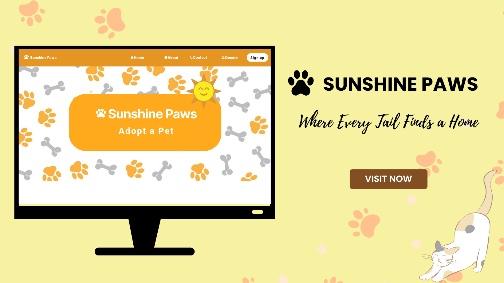
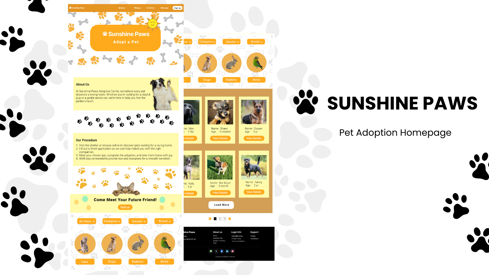
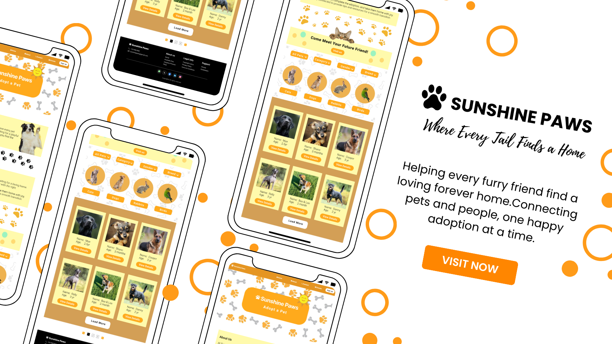
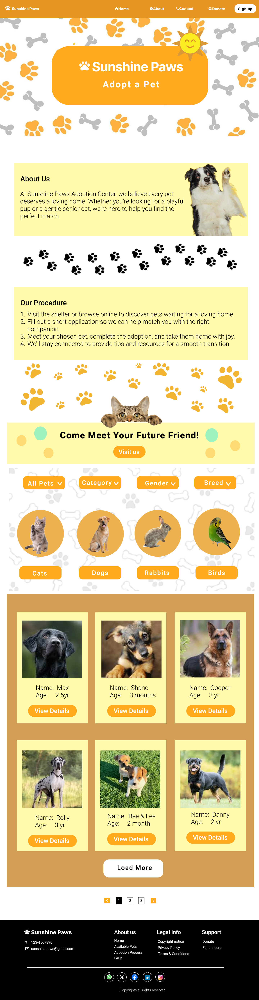
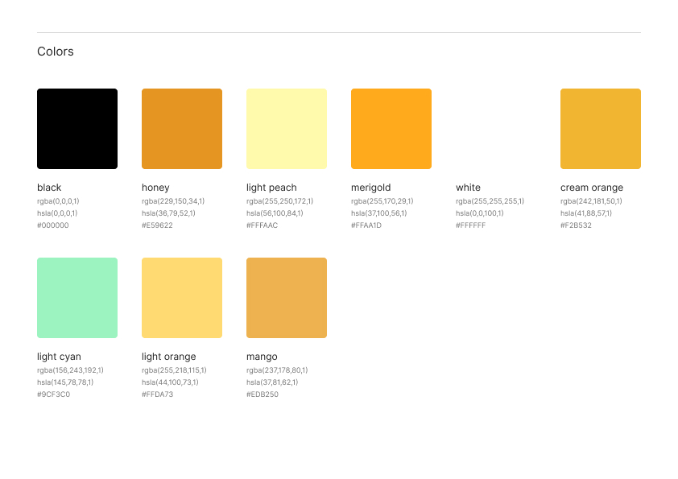

# 🌞🐾 Sunshine Paws – Pet Adoption Homepage

**Elevvo Pathways – Task 3**

This project is a **Pet Adoption Homepage design** created as part of **Elevvo Pathways Task 3**.

---

## ✨ Features

- 🐕 **Welcoming Message with Hero Image** – creates a warm first impression
- 🐾 **Featured Pets Section** – includes pet image, name, and age
- 🎨 **Friendly Colors** – builds trust and positive emotions

---

## 🛠️ Tools

- **Figma** – UI/UX design and prototyping
- **Canva** – graphics, mockups, and presentation

---

## 📸 Preview

### Mockups

### Homepage Design

### Color Style

---

## 🚀 How to View

1. Open the design files in **Figma**.

👉 [Figma Link](https://www.figma.com/design/4X8j0aHekyeVyDShL8Z80o/Task4-5?node-id=1-1523&t=B8HAG5m1mDdhsdQN-1)

---

## 🏷️ License

This project was created for **Elevvo – Task 3**.  
Free to use for **learning** and **portfolio** purposes.
